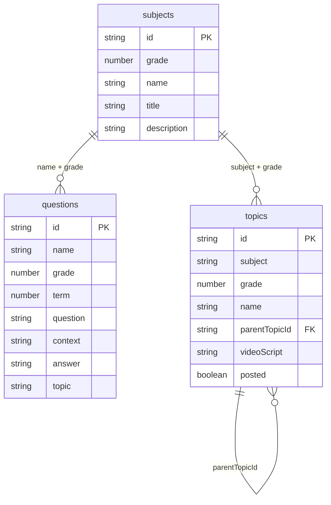

# Database structure

Matric Unlocked uses [Firebase Firestore](https://firebase.google.com/docs/firestore) as its database. All application data lives in three top-level collections: `subjects`, `questions`, and `topics`.

## Overview



## Grade IDs

The `grade` field is an internal numeric id, not the matric year directly.

| `grade` | Label    |
| ------- | -------- |
| `1`     | Grade 12 |
| `2`     | Grade 11 |
| `3`     | Grade 10 |

The app currently only surfaces Grade 12 (`grade: 1`) subjects.

## Collection: `subjects`

Catalog of subjects available in the app. Seeded from `subjects.csv`.

### Document ID

```
grade-{grade}-{slug}
```

Example: `grade-1-mathematics-p1`

The slug is the subject name lowercased with non-alphanumeric characters replaced by hyphens.

### Fields

| Field         | Type     | Required | Description                          |
| ------------- | -------- | -------- | ------------------------------------ |
| `grade`       | number   | yes      | Internal grade id (see table above)  |
| `name`        | string   | yes      | Display name, e.g. `"Mathematics P1"` |
| `title`       | string   | no       | Alternative display label            |
| `description` | string   | no       | Optional subject description         |

### Example

```json
{
  "grade": 1,
  "name": "Mathematics P1"
}
```

### Seed command

```bash
npm run seed:subjects
```

---

## Collection: `questions`

Past exam questions used for topic generation, sub-topic splitting, and video script generation. Seeded from `questions-with-topics.json`.

### Document ID

```
q-{index}
```

Example: `q-000001` (zero-padded 6-digit index from the seed file order)

### Fields

| Field        | Type     | Required | Description                                              |
| ------------ | -------- | -------- | -------------------------------------------------------- |
| `name`       | string   | yes      | Subject name — matches `subjects.name`, e.g. `"Mathematics P1"` |
| `grade`      | number   | yes      | Internal grade id                                        |
| `term`       | number   | yes      | Exam term (see term mapping below)                       |
| `question`   | string   | yes      | Question text                                            |
| `context`    | string   | no       | Passage or setup text before the question                |
| `options`    | mixed    | no       | Answer options — array or object depending on source data |
| `answer`     | string   | yes      | Correct answer                                           |
| `topic`      | string   | no       | Tagged topic name from source data                       |
| `image_path` | string   | no       | Optional image filename                                  |
| `year`       | number   | no       | Exam year, e.g. `2023`                                   |
| `aiExplanation` | string | no    | AI-generated explanation (seeded from `ai_explanation` in JSON) |
| `aiExplanationUpdatedAt` | string | no | ISO timestamp of last explanation generation          |

### Term mapping

| `term` | Exam period   |
| ------ | ------------- |
| `1`, `2` | June exams  |
| `3`, `4` | Final exams |

### Example

```json
{
  "name": "Mathematics P1",
  "grade": 1,
  "term": 3,
  "context": "Given the function f(x) = ...",
  "question": "Calculate the value of x.",
  "options": ["1", "2", "3", "4"],
  "answer": "2",
  "topic": "Functions",
  "image_path": "",
  "year": 2023,
  "aiExplanation": "",
  "aiExplanationUpdatedAt": null
}
```

### Seed command

```bash
npm run seed:questions
```

---

## Collection: `topics`

Exam topics and sub-topics generated by AI or imported manually. Used to drive explainer video script creation and posting workflow.

### Document ID

**Parent topic**

```
grade-{grade}-{subject-slug}-{topic-slug}
```

Example: `grade-1-mathematics-p1-trigonometry`

**Sub-topic**

```
{parentTopicId}--{sub-topic-slug}
```

Example: `grade-1-mathematics-p1-trigonometry--solving-triangles`

### Fields

| Field                  | Type    | Required | Description                                              |
| ---------------------- | ------- | -------- | -------------------------------------------------------- |
| `subject`              | string  | yes      | Subject name — matches `subjects.name`                   |
| `grade`                | number  | yes      | Internal grade id                                        |
| `name`                 | string  | yes      | Topic or sub-topic title                                 |
| `title`                | string  | no       | Alternative display label                                |
| `description`          | string  | no       | What the student must know for this topic                |
| `parentTopicId`        | string  | no       | Set on sub-topics — references the parent topic doc id   |
| `exam`                 | string  | no       | `"june-exams"` or `"final-exams"` when scoped to an exam |
| `order`                | number  | no       | Sort order within a subject or parent topic              |
| `questionCount`        | number  | no       | Estimated or counted number of matching questions      |
| `videoScript`          | string  | no       | Generated explainer video script                         |
| `videoScriptUpdatedAt` | string  | no       | ISO timestamp of last script generation                  |
| `posted`               | boolean | no       | Whether the video has been published                     |
| `postedUrl`            | string  | no       | URL of the published video                               |
| `postedUpdatedAt`      | string  | no       | ISO timestamp of last posted status update               |

### Parent vs sub-topic

- **Parent topic** — no `parentTopicId`. Represents a broad exam area.
- **Sub-topic** — has `parentTopicId` pointing to its parent. Created when a parent topic is too large for a single video.

When a parent topic has sub-topics, scripts are generated for the sub-topics only. Parent topics without sub-topics get their own script.

### Example: parent topic

```json
{
  "subject": "Mathematics P1",
  "grade": 1,
  "name": "Trigonometry",
  "description": "Solving triangles, identities, and exam-style trig questions.",
  "order": 1,
  "questionCount": 42
}
```

### Example: sub-topic

```json
{
  "subject": "Mathematics P1",
  "grade": 1,
  "name": "Solving triangles",
  "description": "Use sine, cosine, and area rules to solve triangle problems.",
  "parentTopicId": "grade-1-mathematics-p1-trigonometry",
  "order": 1,
  "questionCount": 12,
  "videoScript": "...",
  "videoScriptUpdatedAt": "2026-06-19T10:00:00.000Z",
  "posted": false,
  "postedUrl": ""
}
```

---

## Relationships

### Subject → questions

Questions link to a subject via:

- `questions.name` = `subjects.name`
- `questions.grade` = `subjects.grade`

### Subject → topics

Topics link to a subject via:

- `topics.subject` = `subjects.name`
- `topics.grade` = `subjects.grade`

### Topic → sub-topics

Sub-topics link to a parent via:

- `topics.parentTopicId` = parent topic document id

### Topic → questions

There is no foreign key. Questions are matched to topics at runtime by:

1. Exact match on `questions.topic` = topic name, or
2. AI identification when no tagged questions exist

---

## Common queries

| Use case                         | Collection  | Query                                              |
| -------------------------------- | ----------- | -------------------------------------------------- |
| List subjects for a grade        | `subjects`  | `where("grade", "==", 1)`                          |
| Questions for a subject          | `questions` | `where("name", "==", subject)` + `where("grade", "==", grade)` |
| June exam questions              | `questions` | above + `where("term", "in", [1, 2])`              |
| Topics for a subject             | `topics`    | `where("subject", "==", subject)` + `where("grade", "==", grade)` |
| Sub-topics for a parent          | `topics`    | `where("parentTopicId", "==", parentId)`           |

---

## Maintenance scripts

| Command | Effect on database |
| ------- | ------------------ |
| `npm run seed:subjects` | Upserts all subjects from `subjects.csv` |
| `npm run seed:questions` | Upserts all questions from `questions-with-topics.json` |
| `npm run generate:sub-topics` | Creates sub-topic documents under parent topics |
| `npm run generate:video-scripts` | Writes `videoScript` on topic/sub-topic documents |
| `npm run delete:subject -- --subject "..." --grade 1 --confirm` | Deletes all `questions` and `topics` for that subject |

---

## Environment

Firestore is configured via `.env.local`:

```
NEXT_PUBLIC_FIREBASE_API_KEY=
NEXT_PUBLIC_FIREBASE_AUTH_DOMAIN=
NEXT_PUBLIC_FIREBASE_PROJECT_ID=
NEXT_PUBLIC_FIREBASE_STORAGE_BUCKET=
NEXT_PUBLIC_FIREBASE_MESSAGING_SENDER_ID=
NEXT_PUBLIC_FIREBASE_APP_ID=
```

OpenAI (used for topic/script generation, not stored in Firestore):

```
OPENAI_API_KEY=
OPENAI_MODEL=
```
